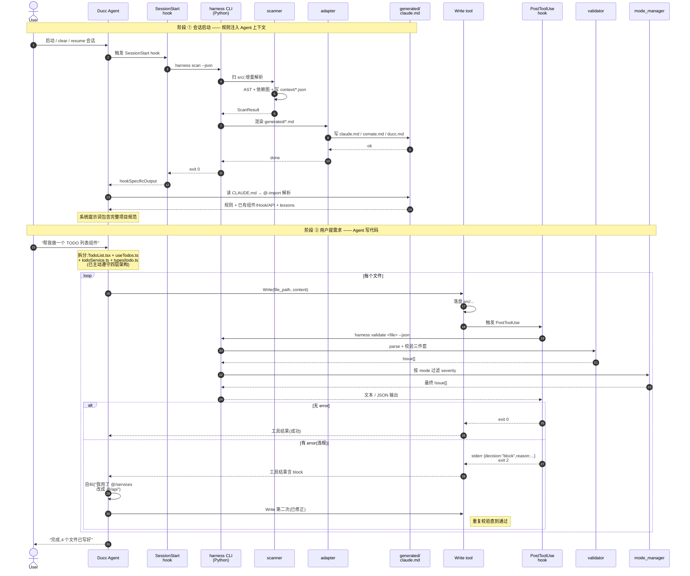

# Harness 2.0 架构总览

> 由人手维护(不在 `harness scan` 自动产物里);代码动了记得回来同步。
> 最后更新:2026-06-23(新增 lesson 动态注入 hook + scan --watch + 全项目 check + hook 调用 / 命名相似 / 循环 / 死代码)

---

## 一、文件树 + 职责

```
.harness/
├── commands/
│   └── harness                       # Shell 启动器,选 venv python 或系统 python,把 lib/cli.py 跑起来
│
├── hooks/
│   ├── validate-code.sh              # PostToolUse hook:Agent Write/Edit src/**/*.{ts,tsx,d.ts} 后自动跑
│   │                                 # harness validate;违规则 stderr 输出 decision:block JSON + exit 2
│   ├── inject-lessons.sh             # PostToolUse hook(同位面):按 file_path + content
│   │                                 # 调 harness lesson match,把命中的经验通过 additionalContext 推给 Agent
│   └── refresh-generated.sh          # SessionStart hook:会话启动/恢复/clear 时跑 harness scan,
│                                     # 刷新 generated/*.md 让新经验进入 Agent 上下文
│
├── lib/                              # ─────────── 核心 Python 库 ───────────
│   ├── __init__.py                   # 空,Python 包标记
│   ├── cli.py                        # Click 子命令路由:scan / validate / check / fix / mode / status /
│   │                                 # lesson / sync / generate / doctor / upgrade / install / uninstall
│   ├── scanner.py                    # 增量扫 src/,按 mtime+sha1 跳过未变文件;
│   │                                 # 产出 project-context / dependency-graph / scan-metadata
│   │                                 # FileRecord 携带 hook_calls(metadata schema_version=2)
│   ├── watch.py                      # scan --watch 后台:watchdog 监听 src/,去抖后跑增量 scan
│   ├── ast_parser.py                 # tree-sitter TS/TSX AST 解析,抽 imports/exports/JSX/hook 调用;
│   │                                 # scanner 和 validator 共用
│   ├── validator.py                  # 单文件校验:架构层 / 导入前缀 / 命名 / hook 调用 / 命名相似度,
│   │                                 # 返回 Issue[]
│   ├── global_check.py               # 全项目维度:Tarjan 循环依赖 + unused-export 死代码;
│   │                                 # 读 scan 产物的 dependency-graph/project-context
│   ├── mode_manager.py               # 治理模式状态机 strict/relaxed/off,
│   │                                 # 按模式过滤 Issue.severity,读写 mode-config.json
│   ├── fixer.py                      # 自动修复 import-forbidden:@/services/foo → @/api/foo,
│   │                                 # --apply 走 git apply 落盘
│   ├── experience_market.py          # 经验市场 CRUD:lesson add/list/show/remove +
│   │                                 # match_lessons(file_path,content) 触发型匹配 +
│   │                                 # .harness-shared/ 同步,Markdown+YAML frontmatter 存储
│   ├── adapter.py                    # 三家 Agent 适配器(Claude/Comate/Ducc),
│   │                                 # 把 rules + scan 结果 + lessons 渲染成 generated/{claude,comate,ducc}.md
│   ├── installer.py                  # 把 hooks 写进 .claude/settings.json,
│   │                                 # 在 CLAUDE.md 注入 @.harness/generated/claude.md;幂等,与第三方 hook 共存
│   └── doctor.py                     # 体检:python / venv / 三方依赖 / rules.yaml /
│                                     # dependency-graph / mode-config / git / 共享盘
│
├── tests/                            # 238 个单测,覆盖所有 lib 模块 + cli + hook 协议
│   ├── _setup.py                     # 测试 PYTHONPATH 注入
│   ├── test_ast_parser.py            # 含 hook_calls 抽取(11 个新)
│   ├── test_scanner.py
│   ├── test_validator.py             # 含 hook_call_check / name_similarity(13 个新)
│   ├── test_validate_cli.py
│   ├── test_global_check.py          # Tarjan + unused-export(17 个)
│   ├── test_check_cli.py             # harness check CLI 集成(7 个)
│   ├── test_mode_manager.py
│   ├── test_fixer.py
│   ├── test_experience_market.py     # 含 match_lessons 触发型匹配测试
│   ├── test_lesson_match_cli.py      # harness lesson match 子命令测试
│   ├── test_inject_lessons_hook.py   # inject-lessons.sh 端到端测试
│   ├── test_watch.py                 # scan --watch 监听器测试
│   ├── test_adapter.py
│   ├── test_installer.py
│   └── test_doctor.py
│
├── memory/                           # ─────────── 经验市场本地存储 ───────────
│   └── lessons/
│       └── <id>.md                   # 单条 lesson:Markdown + YAML frontmatter,
│                                     # scan 时被 adapter 聚合到 generated/*.md
│
├── context/                          # ─────────── scan 运行时产物(gitignored)───────────
│   ├── scan-metadata.json            # 文件指纹(mtime+sha1+解析结果),增量扫的依据
│   ├── project-context.json          # 组件 / Hook / API / 类型 索引
│   └── dependency-graph.json         # 正向 + 反向依赖图
│
├── generated/                        # ─────────── adapter 产物(gitignored)───────────
│   ├── claude.md                     # Claude Code / Ducc 用的项目规范文档(被 CLAUDE.md @-import)
│   ├── comate.md                     # Comate 用的同类文档
│   └── ducc.md                       # Ducc 用的同类文档
│
├── docs/
│   └── harness-2.0-final-design.md   # 设计稿 v2 归档(只读,不影响运行)
│
├── rules.yaml                        # 唯一配置源:architecture.layers / imports / naming /
│                                     # scanner / governance / experience_market
├── mode-config.json                  # 当前治理模式状态,由 harness mode 写
├── VERSION                           # 版本号,doctor 和 generated/*.md 头部用
├── requirements.txt                  # Python 依赖:tree-sitter / tree-sitter-typescript / click / PyYAML
├── .venv/                            # 独立 venv,首次 install 时建(gitignored)
├── .gitignore
├── ARCHITECTURE.md                   # 本文件
├── README.md                         # 人读版规则说明书(自动区+手写区,由 harness generate 产出)
└── VERIFY.md                         # 人肉验证手册,10 章对应 10 个功能链路

# ────────── 项目根的 Harness 触点 ──────────
.harness-shared/
└── lessons/                          # 团队共享 lesson 挂载点(可选,git submodule / NFS / 共享盘均可),
                                      # 由 harness sync 拉到本地

CLAUDE.md                             # 项目级系统提示词,顶部 @.harness/generated/claude.md 把规则注入 Agent 上下文
.claude/
└── settings.json                     # Claude / Ducc 的 hook 配置,由 harness install 维护
```

---

## 二、一个需求从输入到完成 — 时序图

> 场景:用户在已装好 Harness 的 Ducc 会话里说「帮我做一个 TODO 列表组件」。



---

## 三、补充关键事实

### 两道防线分工

| 防线 | 触发时机 | 作用 |
|---|---|---|
| 系统提示词注入 | 会话启动一次 | **预防** — Agent 在生成阶段就遵守规则,不需要事后改;lesson 仅显示标题索引,正文按需注入避免撑提示词 |
| PostToolUse: validate | 每次 Write/Edit | **兜底拦截** — 违规 stderr decision:block + exit 2,Agent 自纠;含架构 / 导入 / hook 调用 / 命名相似 5 大类 |
| PostToolUse: inject-lessons | 每次 Write/Edit | **按需注入** — 按 file_path + content 命中相关 lesson,通过 additionalContext 推给 Agent |
| 开发常驻: scan --watch | 文件变化(可选) | **快速反馈** — watchdog 监听 src/,去抖后跑增量 scan,省 SessionStart 等待 |
| 全项目体检: harness check | 手动 / pre-commit | **离线扫雷** — 跑 Tarjan 找循环依赖 + unused-export 死代码,不卡 PostToolUse |

### 为什么能「零开发接入」

- 配置全集中在 `rules.yaml` 一个文件
- 装上一条 `harness install` 命令把 hooks 和 @-import 写进 `.claude/`,**之后所有 Agent 自动遵守**
- Agent 端**无侵入**:Claude Code / Ducc / Comate 都按 hook 协议工作,不需要它们做任何适配

### Harness 管什么 / 不管什么

| 管 | 不管 |
|---|---|
| 架构层 / 导入前缀 / 命名规范 | 业务逻辑对不对 |
| Hook 调用规则(错层 / 顶层 / 普通函数 / 条件) | 性能 / 安全 / a11y |
| 命名相似度提示(可能的重复实现) | `.js / .jsx`(只解析 ts/tsx/d.ts) |
| 循环依赖 + 死代码(全项目维度) | 架构违规 / 命名违规的自动修复 |
| 团队约定(lessons) | |
| 增量扫描 / 依赖图 | |
| import-forbidden 自动修复 | |

---

## 四、相关文档

- 配置语义:[rules.yaml](./rules.yaml) 自带注释
- 验证清单:[VERIFY.md](./VERIFY.md) — 10 章对应 10 个功能链路,逐项可跑
- 项目级注入:[CLAUDE.md](../CLAUDE.md) → `@.harness/generated/claude.md`
- hook 协议:[.claude/settings.json](../.claude/settings.json) — `harness install` 维护
